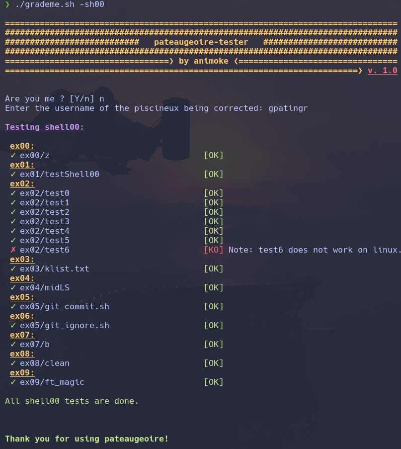

# pataugeoire-tester


pataugeoire-tester is a script to test 42's piscine projects.

It  will do the following tests:

- Check if files exist
- Check norme
- Check prototype
- Check shell scripts and C functions

At the end of the test, a `DEEPTHOUGHT` file will be generated. It contains errors, diff and some useful informations.

This script uses `gcc` with `-Wall -Werror -Wextra` options.


:warning: All the tests made are not the official tests! :warning:

## Installation

You need to have the following file structure:

```
.
∟ piscine/
∟ pataugeoire-tester/
```

Whereas `piscine` contains all your projects, and `pataugeoire-tester` is the folder containing this repository.

You can just clone this repository using git:
```git clone https://github.com/Animoke/pataugeoire-tester.git```


Note that all your projects directories must NOT contain capital letters. e.g:

```
∟ piscine/
          ∟ shell00
          ∟ shell01
          ∟ c00
          ∟ etc..
```

Then just `cd` into `pataugeoire-tester` and run `./grademe.sh`.


## Configuration

Change `src_path` value by setting it to the path of your piscine folder.

e.g: `src_path=../piscine`

## Usage

Simply running `./grademe.sh` will ask you the project to test.

You can use options to run the script without being asked what to test:

#### Options

| Option             | Description             |
| ------------------ | ----------------------- |
| --help <br />-h       | Displays help and exits |
| --shellXX <br />-shXX | Tests only shellXX      |
| --cXX <br /> -cXX     | Tests only cXX          |

